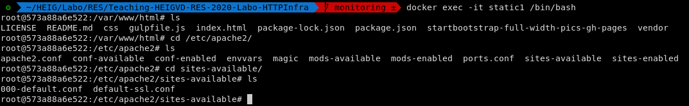
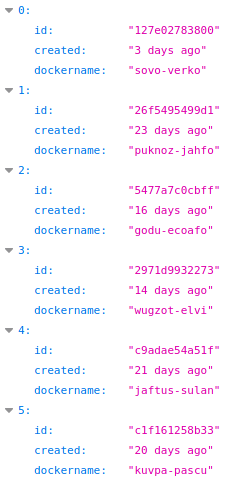

# Teaching-HEIGVD-RES-2020-Labo-HTTPInfra

>- Quentin Saucy
>- Jérôme Arn

## Step 1: Static HTTP server with apache httpd

Le but de cette étape est de faire, à l'aide d'une image docker apache 7.2, un site qui affiche un contenu statique. Dans le "dockerfile" on indique qu'on prend une image php avec apache httpd par défaut. On indique que dans cette image on veut copier le contenu du répertoire **/src** dans **/var/www/html**. Ce répertoire contient notre page web par défaut de bootstrap. lors du lancement du container, on effectue une redirection sur le port **9090**. 

```sh
# content of Dockerfile
# FROM php:7.2-apache
# COPY src/ /var/www/html/
docker build -t my-php-app .
docker run -d -p 9090:80 --name my-running-app my-php-app
docker inspect my-running-app
# http://localhost:9090/
```

```sh
docker exec -it my-running-app /bin/bash
echo "coucou" >index.html
# http://localhost:9090/
```

* Le fichier de configuration se trouve dans  /etc/apache2/sites-available  **000-default.conf** pour changer la racine. Et dans var il y a la page web statique **index.html**. 



## Step 2: Dynamic HTTP server with express.js

Le but de cette partie est de générer dynamiquement toute les secondes des valeurs aléatoires. Pour cela nous avons utilisé **express.js** car comme nous étions novice dans le domaine, nous avons préféré rester avec l'outil montrer pas le professeur. Nous n'avons pas eut à changer beaucoup la configuration montrée dans les webcast. Nous avons toutefois généré un contenu différent à celui présenté dans les vidéos. Nous avons donc utilisé **chancejs** pour générer des pseudos informations docker. Nous avons créé un hash , avec le nombre jours depuis la création de ce docker, et son nom aléatoire. Pour cela nous avons utilisé 3 champs différents offert par **chancejs**:
* hash: génère un hash de 12 caractères
* entier : génère un nombre entre 1 et 30 et on ajoute le texte " days ago"
* mot : génère 2 mots de 2 syllabes connecté par un '-'



## Step 3: Reverse proxy with apache (static configuration)

Dans cette étape, nous devions mettre en place un reverse proxy pour la partie statique et dynamique. Nous avons utilisé la même image que celle du serveur statique. Travaillant sous linux, les images dockers fonctionnent directement sur l'OS et non pas dans une machine virtuel,  le reverse proxy n'est donc pas le seul point d'entrée pour nos containers. Cela vient du fait que notre système fait office d'hôte pour les containers et il n'a pas besoin d'une machine virtuelle. Par contre si on installait notre configuration sur un raspberry pi se trouvant sur notre réseau domestique et qu'on tentait d'y accéder depuis un ordinateur se trouvant sur le même réseau, ce serait le seul point d'entrée. 
Pour faire fonctionner notre RP, nous avons activé les modules proxy et proxy_http. Puis nous avons activé la configuration que nous avons créée. Le "problème" de cette configuration est qu'il faut s'assurer que  les adresses codées en dures sont toujours pareilles. 

* You can do a demo, where you start from an "empty" Docker environment (no container running) and where you start 3 containers: static server, dynamic server and reverse proxy; in the demo, you prove that the routing is done correctly by the reverse proxy.

* You are able to explain why the static configuration is fragile and needs to be improved.

  Because the IP address are hardcoded in the reverse proxy. and they can change when we do a new startup.


### configuration 

Dans le Rp nous avons créé une configuration pour redirigé l'utilisateur en fonction du chemin qu'il entre dans le navigateur. On peut trouver cette configuration dans `/etc/apache2/sites-available`. 

```sh
a2enmod proxy
a2enmod proxy_http
a2ensite 001-*
service apache2 reload
service apache2 restart
```


##  Step 4: AJAX requests with JQuery

Dans cette partie du laboratoire, nous avons mis en place avec script js dans la page **index.html** qui permet de mettre à jour toutes les secondes une partie de cette dernière. En l'occurence, nous avons choisi l'entête de la page dans notre cas. Sans le RP, cette configuration ne serait pas possible parce que c'est le RP qui route la requête du browser vers le bon serveur. 

Dans la partie netword de la page internet on peut voire que c'est bien le browser qui envoie les différentes requêtes. 


```js
// à la fin du fichier index.html 
<script src="vendor/dockers.js"></script>  

// le script appelé à la fin de la page index.html
$(function(){
	console.log("loading dockers");

	function loadDockers(){
		$.getJSON("/api/dynamic/",function(dockers){
			console.log(dockers);
			var message = "Nobody is here";
			if(dockers.length > 0){
				message = dockers[0].id + " " + dockers[0].created+" "+dockers[0].dockername;
			}
			$(".navbar-brand").text(message);
		});
	};
	loadDockers();
	setInterval(loadDockers, 2000);
});
```


## Step 5: Dynamic reverse proxy configuration

Nous avons repris notre configuration existante de RP et nous  y avons fait les changements suivant :

- le fichier de configuration sera généré par un script php 
- Nous utilisons des variables d'environement pour stocker les adresses et ainsi les passés en argument de la commande `docker run` 
- Modifié le script de lancement des docker. 

Puis dans le script  **apache2-foreground** nous créons dynamiquement la configuration du serveur avec les adresses passées en paramètres avec les variables d'environnement. Dans le script php, nous récupérons les variables d'environnement transmises par le script ci-desous, pour produire un fichier de configuration dynamique pour le RP. 

```sh
docker build -t res/apache_rp ./apache-reverse-proxy 
docker build -t res/apache_static-s1 ./apache-static-S1   
docker build -t res/apache_static-s2 ./apache-static-S2   
docker build --no-cache -t res/express ./express-images

docker run -d --name static1 res/apache_static-s1
export STATIC_APP1=$(docker inspect -f '{{range .NetworkSettings.Networks}}{{.IPAddress}}{{end}}' static1)":80"
echo "ip_static1: $STATIC_APP1"

docker run -d --name static2 res/apache_static-s2
export STATIC_APP2=$(docker inspect -f '{{range .NetworkSettings.Networks}}{{.IPAddress}}{{end}}' static2)":80"
echo "ip_static2: $STATIC_APP2"

docker run -v /var/run/docker.sock:/var/run/docker.sock -d --name express1 res/express
export DYNAMIC_APP1=$(docker inspect -f '{{range .NetworkSettings.Networks}}{{.IPAddress}}{{end}}' express1)":3000"
echo "ip_dynamic1 :$DYNAMIC_APP1"

docker run -v /var/run/docker.sock:/var/run/docker.sock -d --name express2 res/express
export DYNAMIC_APP2=$(docker inspect -f '{{range .NetworkSettings.Networks}}{{.IPAddress}}{{end}}' express2)":3000"
echo "ip_dynamic2 :$DYNAMIC_APP2"
```

* You are able to do an end-to-end demo with a well-prepared scenario. Make sure that you can demonstrate that everything works fine when the IP addresses change

## Load balancing: multiple server nodes (0.5pt)

* You show that you can have **multiple static server nodes** and **multiple dynamic server nodes**. 
* You prove that the **load balancer** can distribute HTTP requests between these nodes.

To execute the load balancing byrequest on apache. To do that, i have enable the following modules **lbmethod_byrequests and proxy_balancer**. The infrastructure will be made of 2 statics servers and 2 dynamics servers. First with my building script I run these 4 servers and i catch the 4 Ip adress in environnement variables. And I give these varaiables when i run the reverse proxy container. 

In the template for configuration of the reverse proxy, I have made the modifications that was given on https://httpd.apache.org/docs/2.4/mod/mod_proxy_balancer.html . 

## Load balancing: round-robin vs sticky sessions (0.5 pt)

* You do a setup to demonstrate the notion of sticky session.
* You prove that your load balancer can distribute HTTP requests in a round-robin fashion to the dynamic server nodes (because there is no state).
* You prove that your load balancer can handle sticky sessions when forwarding HTTP requests to the static server nodes.

## Management UI (0.5 pt)

* You develop a web app (e.g. with express.js) that administrators can use to monitor and update your web infrastructure.
* You find a way to control your Docker environment (list containers, start/stop containers, etc.) from the web app. For instance, you use the Dockerode npm module (or another Docker client library, in any of the supported languages).
