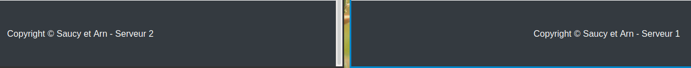

# Teaching-HEIGVD-RES-2020-Labo-HTTPInfra

>- Quentin Saucy
>- Jérôme Arn

## Step 1: Static HTTP server with apache httpd

Le but de cette étape est de faire, à l'aide d'une image docker apache 7.2, un site qui affiche un contenu statique. Dans le "dockerfile" on indique qu'on prend une image php avec apache httpd par défaut. On indique que dans cette image on veut copier le contenu du répertoire **/src** dans **/var/www/html**. Ce répertoire contient notre page web par défaut de bootstrap. lors du lancement du container, on effectue une redirection sur le port **9090**. 

```sh
# content of Dockerfile
# FROM php:7.2-apache
# COPY src/ /var/www/html/
docker build -t my-php-app .
docker run -d -p 9090:80 --name my-running-app my-php-app
docker inspect my-running-app
# http://localhost:9090/
```

```sh
docker exec -it my-running-app /bin/bash
echo "coucou" >index.html
# http://localhost:9090/
```

* Le fichier de configuration se trouve dans  /etc/apache2/sites-available  **000-default.conf** pour changer la racine. Et dans var il y a la page web statique **index.html**. 


## Step 2: Dynamic HTTP server with express.js

Le but de cette partie est de générer dynamiquement toutes les secondes des valeurs aléatoires. Pour cela nous avons utilisé **express.js** car comme nous étions novices dans le domaine, nous avons préféré rester avec l'outil montrer pas le professeur. Nous n'avons pas eu à changer beaucoup la configuration montrée dans les webcast. Nous avons toutefois généré un contenu différent à celui présenté dans les vidéos. Nous avons donc utilisé **chancejs** pour générer des pseudos informations docker. Nous avons créé un hash , avec le nombre jours depuis la création de ce docker, et son nom aléatoire. Pour cela nous avons utilisé 3 champs différents offerts par **chancejs**:
* hash: génère un hash de 12 caractères
* entier : génère un nombre entre 1 et 30 et on ajoute le texte " days ago"
* mot : génère 2 mots de 2 syllabes connecté par un '-'


## Step 3: Reverse proxy with apache (static configuration)

Dans cette étape, nous devions mettre en place un reverse proxy pour la partie statique et dynamique. Nous avons utilisé la même image que celle du serveur statique. Travaillant sous linux, les images dockers fonctionnent directement sur l'OS et non pas dans une machine virtuelle,  le reverse proxy n'est donc pas le seul point d'entrée pour nos containers. Cela vient du fait que notre système fait office d'hôte pour les containers et il n'a pas besoin d'une machine virtuelle. Par contre si on installait notre configuration sur un raspberry pi se trouvant sur notre réseau domestique et qu'on tentait d'y accéder depuis un ordinateur se trouvant sur le même réseau, ce serait le seul point d'entrée. 
Pour faire fonctionner notre RP, nous avons activé les modules proxy et proxy_http. Puis nous avons activé la configuration que nous avons créée. Le "problème" de cette configuration est qu'il faut s'assurer que  les adresses codées en dures soient toujours pareilles. 


### configuration 

Dans le Rp nous avons créé une configuration pour redirigé l'utilisateur en fonction du chemin qu'il entre dans le navigateur. On peut trouver cette configuration dans `/etc/apache2/sites-available`. 

```sh
a2enmod proxy
a2enmod proxy_http
a2ensite 001-*
service apache2 reload
service apache2 restart
```


##  Step 4: AJAX requests with JQuery

Dans cette partie du laboratoire, nous avons mis en place  un script js dans la page **index.html** qui permet de mettre à jour toutes les secondes une partie de cette dernière. En l'occurrence, nous avons choisi l'entête de la page dans notre cas. Sans le RP, cette configuration ne serait pas possible parce que c'est le RP qui route la requête du browser vers le bon serveur. 

Dans la partie network de la page internet on peut voire que c'est bien le browser qui envoie les différentes requêtes. 


```js
// à la fin du fichier index.html 
<script src="vendor/dockers.js"></script>  

// le script appelé à la fin de la page index.html
$(function(){
	console.log("loading dockers");

	function loadDockers(){
		$.getJSON("/api/dynamic/",function(dockers){
			console.log(dockers);
			var message = "Nobody is here";
			if(dockers.length > 0){
				message = dockers[0].id + " " + dockers[0].created+" "+dockers[0].dockername;
			}
			$(".navbar-brand").text(message);
		});
	};
	loadDockers();
	setInterval(loadDockers, 2000);
});
```


## Step 5: Dynamic reverse proxy configuration

Nous avons repris notre configuration existante de RP et nous  y avons fait les changements suivant :

- le fichier de configuration sera généré par un script php 
- Nous utilisons des variables d'environement pour stocker les adresses et ainsi les passés en argument de la commande `docker run` 
- Modifié le script de lancement des docker. 

Puis dans le script  **apache2-foreground** nous créons dynamiquement la configuration du serveur avec les adresses passées en paramètres avec les variables d'environnement. Dans le script php, nous récupérons les variables d'environnement transmises par le script ci-dessous, pour produire un fichier de configuration dynamique pour le RP.  Dans le script suivant nous reconstruisons les images à chaque fois dans le cas où nous aurions fait une modification, ceci afin de s'éviter des surprises lors de nos tests. 

```sh
docker build -t res/apache_rp ./apache-reverse-proxy 
docker build -t res/apache_static-s1 ./apache-static-S1   
docker build -t res/apache_static-s2 ./apache-static-S2   
docker build --no-cache -t res/express ./express-images

docker run -d --name static1 res/apache_static-s1
export STATIC_APP1=$(docker inspect -f '{{range .NetworkSettings.Networks}}{{.IPAddress}}{{end}}' static1)":80"
echo "ip_static1: $STATIC_APP1"

docker run -d --name static2 res/apache_static-s2
export STATIC_APP2=$(docker inspect -f '{{range .NetworkSettings.Networks}}{{.IPAddress}}{{end}}' static2)":80"
echo "ip_static2: $STATIC_APP2"

docker run -v /var/run/docker.sock:/var/run/docker.sock -d --name express1 res/express
export DYNAMIC_APP1=$(docker inspect -f '{{range .NetworkSettings.Networks}}{{.IPAddress}}{{end}}' express1)":3000"
echo "ip_dynamic1 :$DYNAMIC_APP1"

docker run -v /var/run/docker.sock:/var/run/docker.sock -d --name express2 res/express
export DYNAMIC_APP2=$(docker inspect -f '{{range .NetworkSettings.Networks}}{{.IPAddress}}{{end}}' express2)":3000"
echo "ip_dynamic2 :$DYNAMIC_APP2"
```

## Load balancing: multiple server nodes 

Pour exécuter le RP en mode load balancing nous avons activé les modules **lbmethod_byrequests, status and proxy_balancer**. L'infrastructure de test se constituera de 2 noeuds dynamiques et de 2 noeuds statiques. Nous avons ajouté l'option qui permet de montrer la charge des serveurs avec le module status. Cette page est accessible via l'onglet **Load-manager**.  Dans le fichier de config, nous  avons modifié comme dans le script ci-dessous selon les instructions du site https://httpd.apache.org/docs/2.4/mod/mod_proxy_balancer.htm. 

```sh
	# ajout des deux membres dynamiques
	<Proxy 'balancer://static'>
		BalancerMember 'http://<?php print "$ipStatic1"?>' route=1
		BalancerMember 'http://<?php print "$ipStatic2"?>' route=2
	</Proxy>
	
	# ajout des deux membres statiques
	<Proxy 'balancer://dynamic'>
		BalancerMember 'http://<?php print "$ipDynamic1"?>' route=1
		BalancerMember 'http://<?php print "$ipDynamic2"?>' route=2
	</Proxy>
	
	# configuration de la page load balancer. 
    <Location '/balancer-manager'>
        ProxyPass !

        SetHandler balancer-manager
        # Require host demo.res.ch
        # Order Deny,Allow
        # Allow from all 
    </Location>
```

On peut voir ici que nous avons accès au deux serveurs statiques. 



## Load balancing:  sticky sessions

Le principe de régulateur de charge avec **sticky session** consiste à rediriger un client toujours vers le même serveur. Ce qui fait que si on va sur le site **demo.res.ch:8080** avec notre navigateur et qu'on est servi par le serveur 1, cela restera "notre serveur". Ce qui n'arriverait pas dans un mode round robin ou chaque serveur est appelé tour à tour. Pour faire cela nous avons ajouté, comme pour l'exemple de https://httpd.apache.org/docs/2.4/mod/mod_proxy_balancer.html, le module headers qui permet de modifier les entêtes des requêtes et réponses http. De plus on indique quelle route doit prendre un client avec la session courante. 

Pour tester nous avons utilisé le navigateur firefox de manière normale, qui s'est vu attribuer le serveur 1, et firefox en mode privé, qui s'est vu attribuer le serveur 2. On peut actualiser la page autant de fois que l'on désire on va rester sur le même serveur. 

```sh
	Header add Set-Cookie "ROUTEID=.%{BALANCER_WORKER_ROUTE}e; path=/" env=BALANCER_ROUTE_CHANGED
	<Proxy 'balancer://static'>
		BalancerMember 'http://<?php print "$ipStatic1"?>' route=1
		BalancerMember 'http://<?php print "$ipStatic2"?>' route=2
		ProxySet stickysession=ROUTEID
	</Proxy>
```

 

## Management UI 

Le management depuis un site web a été réalisé grâce à dockerode. Cet outil permet d'effectuer des appels sur l'API de docker. L'implémentation proposée est un proof of concept avec quelques informations sur les dockers.

## Liste containeurs

La première fonctionnalité de ce module est de lister les différents containeurs sur la machine hôte. Dans cette liste on peut y voir le nom de la machine, son adresse ip actuelle (champ vide si éteint), et un bouton permettant de changer l'état de la machine.

Cette liste est disponible via l'url /api/docker

## Changement d'état

La seconde fonctionnalité offerte est la possibilité de changer l'état de la machine, (on-> off, off->on). Une fois le containeur a changé d'état(cela peut prendre plusieurs secondes) la page web se met à jour. Pour accéder à cette machine, le champ [stop/start] est un lien ayant comme id le hash du docker. 

Cette action est disponible via l'url `/api/docker/:uid`, ou uid est le hash.

## Intégration

Pour intégrer le management UI dans le projet, il a fallu modifier, les règles du reverse proxy ainsi qu'adapter les contenus des containeurs express et statiques. Il a également fallu modifier le script de build des images

### Modfication apache statique

index.html

* Ajout d'une `<table id="dataTable">`. Cette table recevra la liste des différents dockers présent.
* Ajout d'une inclusion de script `<script src="vendor/dockerMain.js"></script>`

Ajout d'un fichier `vendor/dockerMain.js`

* fonction dockerMain qui est appelé une fois jquery initialisé. Cette fonction accède à l'url `/api/docker` et met en passe 
* Action sur le clic d'un lien(on-off) : accède à l'url `/api/docker/:uid`. Une fois que le serveur envoi un succès(asyncrone), appele la fonction dockerMain.

### Modification express

Ajoute de deux routes dans la gestion d'express:

* `/api/docker/`: retourne tous les containeurs sur la machine
* `/api/docker/:uid`: envoie un signal au containeur de changer d'état. Une fois le changement effectuer(peut prendre plusieurs secondes), envoi au client une chaine vide pour que le client puisse continuer son process

### Règles reverse proxy

Ajout de la route `/api/docker/ ` vers les serveurs nodejs. Gère également `/api/docker/:uid`

```
ProxyPass '/api/docker/' 'balancer://dynamic/api/docker/'
ProxyPass '/api/docker/' 'balancer://dynamic/api/docker/'
```

### Modification script build

Pour avoir accès aux informations des dockers au sein d'un docker, il a fallu monter dans la vm le socket docker

```
docker run -v /var/run/docker.sock:/var/run/docker.sock -d --name express1 res/express
```


## Vérification du système

La vérification a été de comparer le contenu du tableau sur la page web et les informations de `docker ps -a`

Tous les containeurs sont allumés sauf static1


Tous les containeurs sont Up sauf serene_borg et static1 


## Problèmes connus

Le système ne vérifie pas si le containeur à arrêter est utile ou non. Il est tout à fait possible d'arrêter le reverse proxy où tous les containeurs présentant le site web, dès lors il n'y a plus de feedback mais l'action demandée a bien été effectuée. Pour le vérifier `docker ps`.